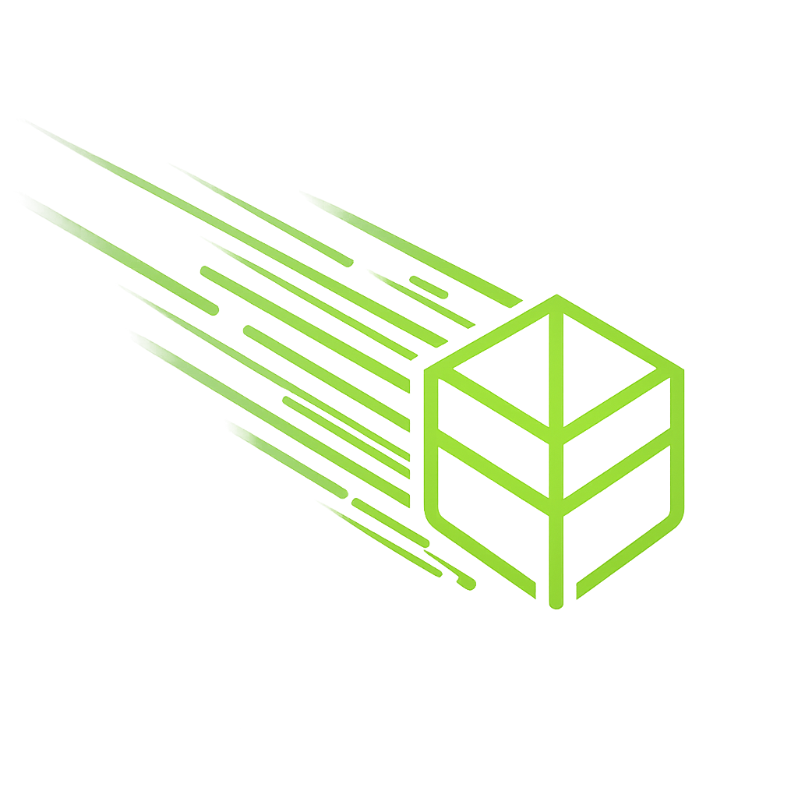
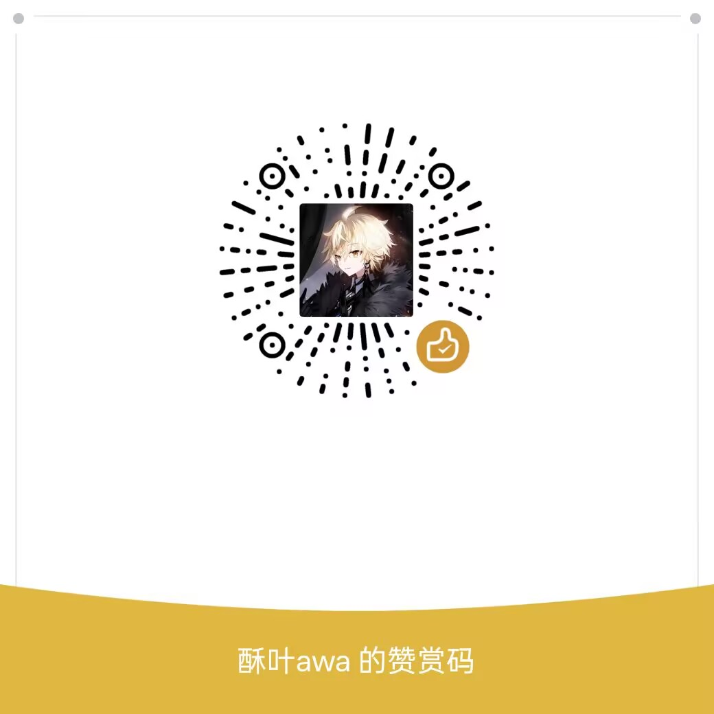

<h3 align="center">
   
  LeavesHack-Addon for <a href="https://meteorclient.com">Meteor Client</a>
</h3>

    
    
    
  

  <i>致力于改善无政府服务器的游玩体验 / Dedicated to improving the anarchy server experience</i> 
  <i>适用Grim反作弊 / Designed for Grim Anti-Cheat</i>

---

## 语言 / Language

- [简体中文](#简体中文)
- [English](#english)

---

## 简体中文

bilibili: https://space.bilibili.com/1932462042  
神秘群聊欢迎吹水：  
1群：1076456572  
2群：2160060506  
中文使用文档：https://leaveshack.netlify.app/

### 注意事项

- 这个东西是我玩3c3u写的，开源只是顺手，我想写什么就写什么，readme的更新有一定滞后性，我尽量把每个模块的教程写上
- 插件现在已经自带汉化系统，打开GlobalSetting(全局设置)，在里面找到Chinese选项，打开即可
- Meteor本身不支持中文渲染，可以通过下载现代化UI和模组菜单，打开现代化UI的文本引擎，对字体规则选择“忽略全部”，再关闭Meteor的CustomFont解决
- 理论上AntiAntiXray可以绕过其他服务器的假矿或其他反矿透插件，如果腐竹不给开挂，而且你使用这个插件导致被封号等等后果请自负
- 如果你觉得这个插件不错可以请我吃个肠粉，咕咕嘎嘎

  

### 功能

截至目前更新的功能，基本上默认参数就能在3c使用：

|        模块         | 描述                                    | 注意事项                                |
|:-----------------:|---------------------------------------|-------------------------------------|
|   AntiAntiXray    | 雷达扫描矿透                                | 不装 Baritone 开功能崩端                   |
|       Aura        | 可在 3c3u 使用的不卡脚的杀戮                     | 无                                   |
|    AutoAnchor     | 自动重生锚                                 | 无                                   |
|   AutoArmorPlus   | 自动穿甲（主要为了和 FireworkElytraFly 联动自动穿鞘翅） | 无                                   |
|     AutoCity      | 自动挖脚（顺手的事，记住咱是生存端）                    | 无                                   |
|    AutoCrystal    | 自动水晶                                  | 无                                   |
|     AutoLogin     | 自动登录                                  | 无                                   |
|  AutoPlaceBlock   | 自定义范围方块放置                             | 无                                   |
| AutoRefreshTrade  | 自动刷新村民交易的附魔书                          | 无                                   |
|     AutoTorch     | 自动放火把 (白天可用 + 无光区域渲染)                 | 无                                   |
|     AutoTree      | 自动种树                                  | 左键选择目标方块，手持树苗时工作                    |
| FireworkElytraFly | 在鞘翅飞行时自动使用烟花 (含甲飞)                    | 无                                   |
|    LegitNoFall    | 自动落地水                                 | 95% 的成功率，自动检测下界，不要在没有副手图腾的情况下信任这个模块 |
|     NukerPlus     | 绕过 3c3u 的 Nuker                       | 无                                   |
|    ModuleList     | 重写模块列表渲染                              | 无                                   |
|    PacketMine     | 绕过 3c3u 的发包挖掘（可双挖）                    | 无                                   |
|   PistonCrystal   | 活塞水晶                                  | 无                                   |
|      Printer      | 投影打印机                                 | 测试中，不装投影开功能崩端                       |
|   ScaffoldPlus    | 自动搭路 (可自适应半砖)                         | 放下半砖的时候不稳定，斜着走的时候慢一点不然容易坠机          |

---

## English

bilibili: https://space.bilibili.com/1932462042   
Documentation: https://leaveshack.netlify.app/

### Notes

- This addon was originally written for playing on 3c3u. Open-sourcing it was just a side thing. I'll add whatever I want, and README updates may lag behind. I'll try to include tutorials for each module.
- The addon now includes a built-in Chinese localization system. Open GlobalSetting and enable the Chinese option.
- Meteor Client does not natively support Chinese rendering. You can fix this by installing Modern UI and Mod Menu, enabling Modern UI's text engine, setting font rules to "Ignore All", and then disabling Meteor's CustomFont.
- In theory, AntiAntiXray can bypass fake ore and anti-Xray plugins on other servers. If the server owner does not allow cheating and you get banned for using this addon, you are responsible for the consequences.
- If you think this addon is good, you can treat me to a rice noodle roll. Coo coo ga ga.

  

### Features

The following features are updated so far. Default parameters should work on 3c3u:

|      Module       | Description | Notes |
|:-----------------:|-------------|-------|
|   AntiAntiXray    | Radar ore scanner | Crashes without Baritone installed |
|       Aura        | KillAura that doesn't clip feet on 3c3u | None |
|    AutoAnchor     | Auto respawn anchor | None |
|   AutoArmorPlus   | Auto armor equip (mainly for FireworkElytraFly synergy) | None |
|     AutoCity      | Auto city break (survival client, remember) | None |
|    AutoCrystal    | Auto crystal | None |
|     AutoLogin     | Auto login | None |
|  AutoPlaceBlock   | Custom range block placement | None |
| AutoRefreshTrade  | Auto refresh villager enchanted books | None |
|     AutoTorch     | Auto place torches (daytime usable + dark area rendering) | None |
|     AutoTree      | Auto tree planting | Left-click target block, works when holding saplings |
| FireworkElytraFly | Auto firework during elytra flight (includes armor fly) | None |
|    LegitNoFall    | Auto MLG water bucket | 95% success rate, auto detects Nether. Do not trust without offhand totem |
|     NukerPlus     | Nuker bypass for 3c3u | None |
|    ModuleList     | Rewritten module list rendering | None |
|    PacketMine     | Packet mine bypass for 3c3u (dual mine supported) | None |
|   PistonCrystal   | Piston crystal | None |
|      Printer      | Litematica printer | In testing, crashes without Litematica installed |
|   ScaffoldPlus    | Auto scaffold (adaptive half slabs) | Unstable when placing half slabs, walk slower diagonally to avoid falling |

---

## Credits / 致谢

致谢项目 / Projects:

- [Meteor Client](https://github.com/MeteorDevelopment/meteor-client)
- [Meteor-Addon-Template](https://github.com/MeteorDevelopment/meteor-addon-template)
- [Meteor Translation Addon](https://github.com/Nippaku-Zanmu/meteor-translation-addon)
- [Baritone](https://github.com/cabaletta/baritone)
- [Epsilon](https://github.com/NekoyaHouse/Epsilon)
- [AntiAntiXray](https://github.com/tokfrans03/AntiAntiXray)  

特别致谢 / Special Thanks:
- L3MonKe
- Chen Meng
- matl
